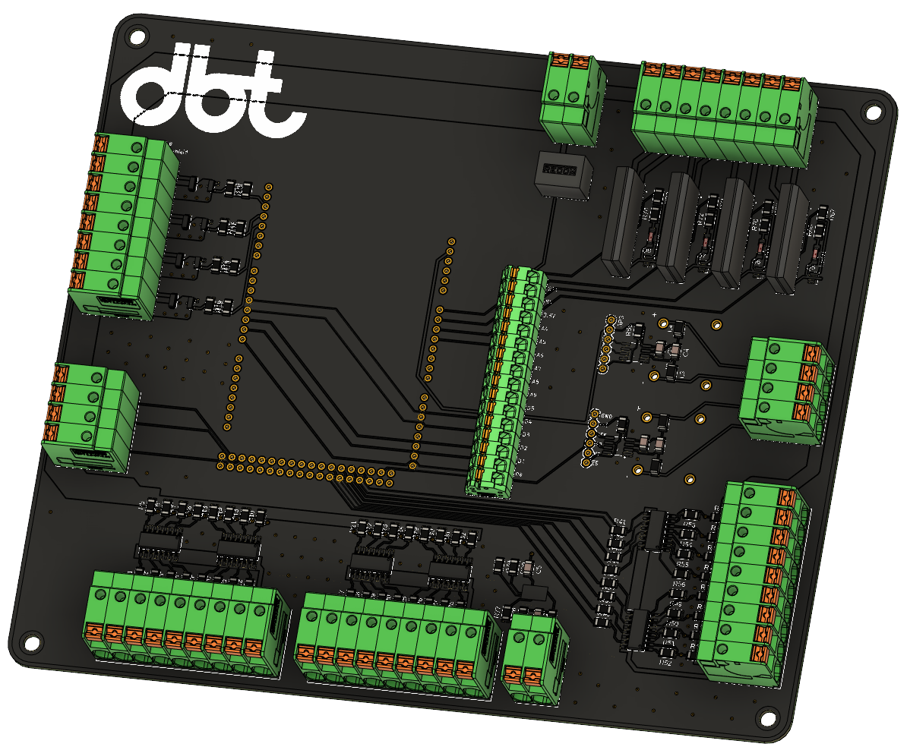
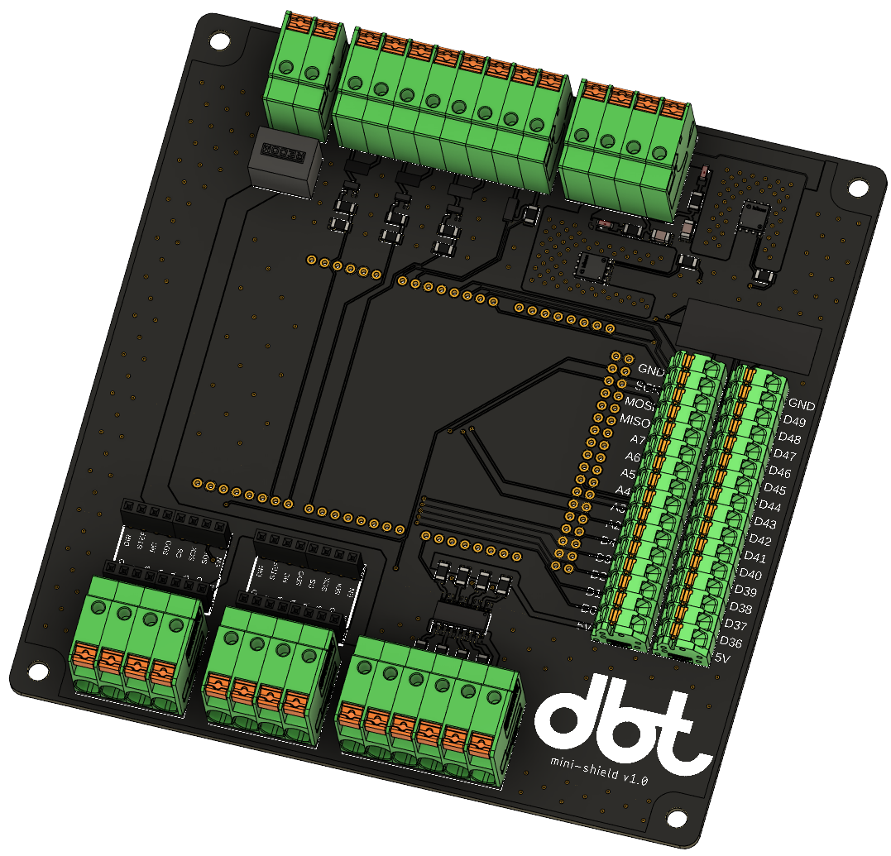
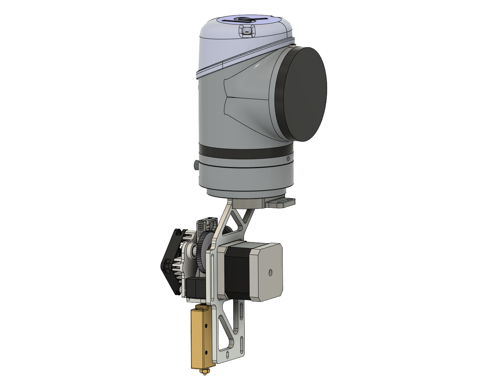

# dbt-shield
Shield: Pellet extrusion controller for ABB robotic arms w/ profinet I/O

Mini-shield: Filament extrusion controller for UR arms, to be used in the MAS ETH DFAB

## Shield
---

### Specs
---
16bit 24V digital Input\
8bit 24v digital Output\
4bit 0-10v analog Input\
4x 500mW MOSFETS\
4x SSR 240VAC 2A\
2x K-Type Thermocouple amplifiers

## Mini-Shield

### Specs
---
4bit 24V digital Input\
2x TMC2130 Stepper Driver\
2x 100W MOSFETS\
3x 500mW MOSFETS\
1x 104NT thermistor

[Pin-Out / Set-Up / Connections](https://github.com/hiiragii/dbt-shield/tree/master/mini)

### UR5 FDM  

UR 5 e3d Titan Aero + Super Volcano mounting bracket
[stl / step files](https://github.com/hiiragii/dbt-shield/tree/master/ur5aero)
